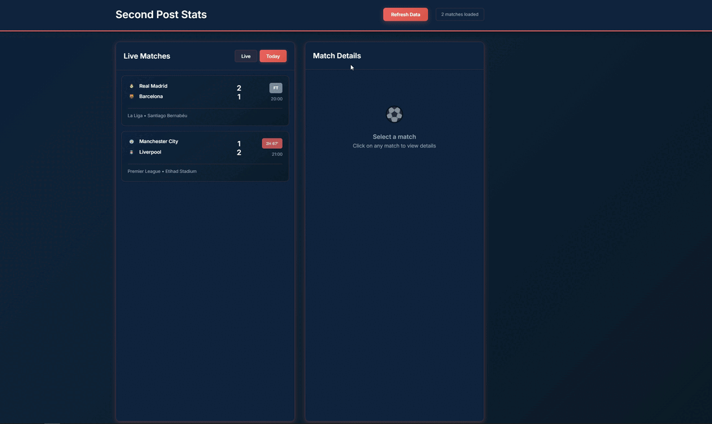

# ⚽ Second Post Stats - Football Analytics App

A modern, real-time football statistics application built with Flask, featuring live match data, team lineups, and interactive football formations.

## 🎯 Project Overview

Second Post Stats is a full-stack web application designed to showcase modern web development skills while delivering real-time football statistics and match analytics. Built as a portfolio project demonstrating proficiency in:

- **Backend Development** with Flask and SQLAlchemy
- **API Integration** with rate limiting and caching
- **Database Management** with SQLite
- **Frontend Development** with modern CSS and JavaScript
- **Real-time Data Processing** and visualization

## 🎮 Demo Gifs

*Watch the app in action: live match data, team formations, and real-time updates*

## ✨ Features

### 🔴 Live Match Tracking
- **Real-time scores** and match status updates
- **Live indicators** with pulsing animations
- **Match filtering** by Live/Today status
- **Interactive match selection**

### 👥 Team Lineup Visualization
- **Formation-specific positioning** (4-3-3, 4-2-3-1, 5-3-2, etc.)
- **Interactive player positions** with hover effects
- **Coach and formation information**
- **Visual football pitch representation**

### 🔄 Smart Data Management
- **API rate limiting** (100 calls/day protection)
- **Intelligent caching** with SQLite database
- **Static fallback data** for testing
- **Manual refresh** for live updates

### 🎨 Modern UI/UX
- **Minimalistic design** with orange/blue color scheme
- **Responsive layout** for all devices
- **Smooth animations** and transitions
- **Clean typography** and spacing

## 🛠️ Technology Stack

### Backend
- **Flask** - Python web framework
- **SQLAlchemy** - Database ORM
- **SQLite** - Database storage
- **Requests** - API integration

### Frontend
- **HTML5** - Semantic markup
- **CSS3** - Modern styling with Flexbox/Grid
- **JavaScript ES6+** - Interactive functionality
- **Inter Font** - Clean typography

### APIs & Services
- **API-Football** - Live football data
- **RapidAPI** - API management platform

## 🚀 Installation & Setup

### Prerequisites
- Python 3.8+
- Git

### Local Development
